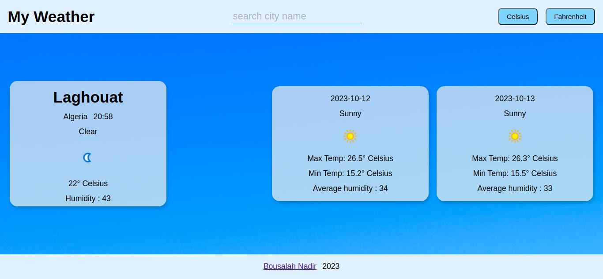
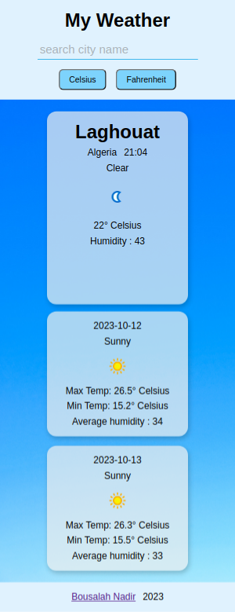

# The-OdinProject-Project-Weather-App

This is a solution to the Weather app project that is part of <a href="https://www.theodinproject.com/lessons/node-path-javascript-weather-app" target="_blank">the Odin project</a>

## Table of contents

- [Overview](#overview)
  - [The challenge](#the-challenge)
  - [Screenshot](#screenshot)
  - [Links](#links)
- [My process](#my-process)
  - [Built with](#built-with)
- [Author](#author)
  [Acknowledgments](#acknowledgments)

## Overview

### The challenge

Users should be able to:

- view current weather in a chosen city
- view forecast for the next 2 days for a chosen city
- change displayed temperature between Celsius and fahrenheit

### Screenshot
  ## Desktop

  

  ## Mobile
  

### Links

- Solution URL: [solution](https://github.com/Medido1/The-OdinProject-Project-Weather-App)
- Live Site URL: [live site]()

## My process

### Built with

- Semantic HTML5 markup
- CSS custom properties
- Flexbox
- CSS Grid
- Vanilla javascript

## Author

- GitHub - [@Medido1](https://github.com/Medido1)

